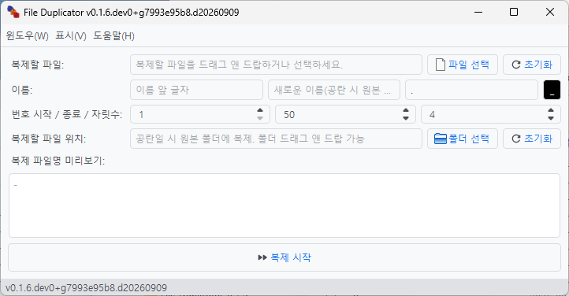

# File Duplicator

Created by. D-DL (with chatgpt)

특정 파일을 시작숫자~종료숫자 만큼 복제합니다.

반드시 렌더링이 필요하지 않은 프레임을 채워넣기 위해 제작되었습니다.

Pyside6로 제작.

# Features

1. 새 이름 생성, 이름 앞/뒤 문자 지정
1. 복제될 파일이 위치할 경로 따로 추가

등등...

# More

- [레포지토리](https://github.com/d-dlzndi/file_duplicator)
- [제작자](https://github.com/d-dlzndi)

# License

MIT License